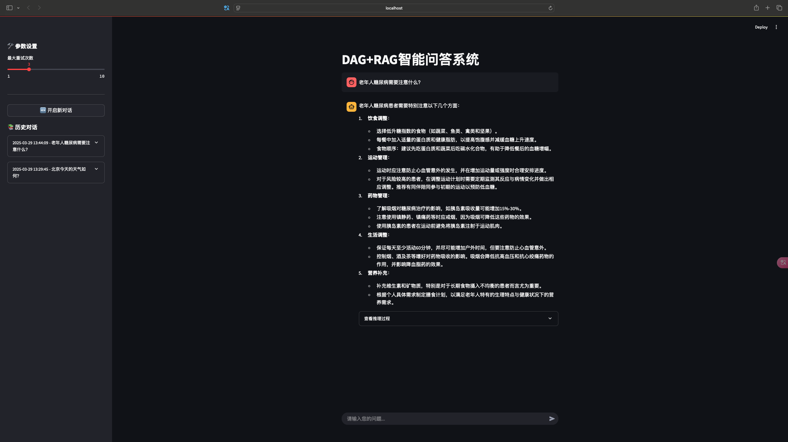
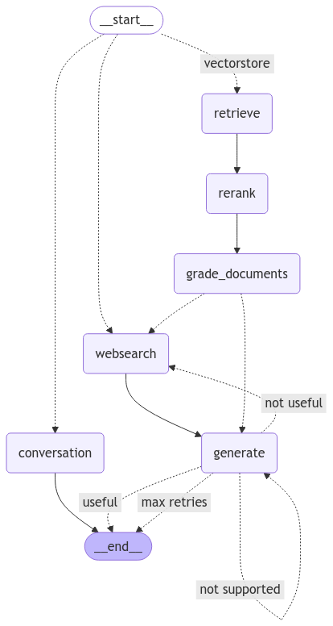

# LanggraphRAG

LanggraphRAG 是一个基于 LangGraph 和检索增强生成（RAG）技术的智能对话系统。



基于 LangGraph 和 RAG 技术构建的智能对话流程



## 项目简介

LanggraphRAG 是一个结合了 LangGraph 和检索增强生成（RAG）技术的智能对话系统。该项目利用先进的语言模型和知识检索技术，实现了高效的信息检索和自然语言生成功能。

## 主要特性

- 基于 LangGraph 的工作流编排
- 高效的向量检索系统
- 支持多种语言模型集成
- 提供终端和 Web 应用两种交互方式
- 可扩展的知识库管理

## 项目结构

```
LanggraphRAG/
├── src/                    # 源代码
│   ├── dag/               # LangGraph DAG 工作流定义
│   ├── retriever/         # 检索器实现
│   └── config.py          # 配置文件
├── demo/                   # 示例应用
│   ├── run_terminal.py    # 终端应用
│   ├── run_app.py         # Web 应用
│   └── vectordb/         # 向量数据库存储
└── requirements.txt       # 项目依赖
```

## 安装说明

1. 克隆项目
```bash
git clone https://github.com/Wbxxx/LanggraphRAG.git
cd LanggraphRAG
```

2. 创建并激活虚拟环境（推荐）
```bash
conda create -n langgraph python=3.10
conda activate langgraph
```

3. 安装依赖
```bash
pip install -r requirements.txt
```

4. 配置环境变量
```bash
cp src/.env.example src/.env
# 编辑 .env 文件，填入必要的 API 密钥和配置
```

## 使用方法

### 终端应用

运行终端交互式应用：
```bash
python demo/run_terminal.py
```

### Web 应用

启动 Web 应用服务：
```bash
streamlit run run_app.py
```

访问 `http://localhost:8501` 开始使用 Web 界面。

## 贡献指南

欢迎提交 Issue 和 Pull Request 来帮助改进项目。在提交 PR 之前，请确保：

1. 代码符合项目的编码规范
2. 添加了必要的测试用例
3. 更新了相关文档

## 许可证

本项目采用 MIT 许可证 - 查看 [LICENSE](LICENSE) 文件了解详情。

## 联系方式

如有任何问题或建议，欢迎通过以下方式联系：

- 提交 Issue
- 发送邮件至：[wangbjjj@gmail.com]

## 致谢

本项目基于
https://github.com/langchain-ai/langgraph/blob/main/docs/docs/tutorials/rag/langgraph_adaptive_rag.ipynb
进行二次搭建，感谢langgraph的开源精神。 